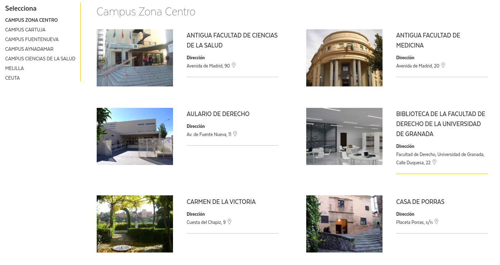

# Patrimonio de Granada en Wikipedia y Wikidata

Desde hace unos meses estamos llevando a cabo [actividades](https://twitter.com/i/moments/815559153406136321) relacionadas con el [Patrimonio de la UGR](http://patrimonio.ugr.es/) orientadas a dar a conocer el patrimonio cultural de la UGR a todo el mundo. Precisamente por eso queremos que la Universidad de Granada tenga más visibilidad en la [Wikipedia](https://es.wikipedia.org/), donde los artículos que hablan sobre su patrimonio son muy pocos en proporción a la gran cantidad de edificios emblemáticos existentes.

Además, también sería interesante ya de paso aumentar la información sobre este mismo patrimonio en [Wikidata](https://www.wikidata.org/wiki/Wikidata:Introduction/es), una base de datos secundaria libre y colaborativa que nos permite trabajar con los datos de forma cuantitativa y precisa.

Este proyecto estará coordinado desde la [Oficina de Software Libre](http://osl.ugr.es/) por [Germán Martínez](https://twitter.com/germaaan_), quien está a cargo del proyecto, junto con [Chá Lucena](https://twitter.com/chalucena). El resultado final será un mapa, que se debería actualizar automáticamente según se añadan nuevos elementos a la Wikipedia.

# En qué vamos a trabajar

Nuestra idea es que la gente interesada en este proyecto trabaje en las siguientes tareas:

- Creación automática de páginas de la Wikipedia a partir del contenido de la web de Patrimonio, que tiene licencia libre, con una posterior curación del mismo añadiéndole referencias, citas y, en su caso, imágenes.
- Inserción automática de datos en Wikidata sobre los edificios del patrimonio.
- Creación de queries para recopilar datos sobre Patrimonio UGR.
- Visualización de datos de Patrimonio en un mapa a partir de la extracción automática de datos de la Wikipedia.
- Creación automática de rutas sobre Patrimonio de la UGR de acuerdo con algún perfil.

# Cómo puedo colaborar

Toda persona es bienvenida a aportar en cualquiera de las tareas, y no es necesario tener un pérfil o conocimientos exclusivamente informáticos, pueden ser útiles los siguientes conocimientos:

- Trabajar con APIs.
- Editar y revisar artículos en la Wikipedia.
- Conocimientos de visualización de datos.
- Análisis de situación y contextualización de la misma.
- Fotografiar y procesar fotos para subirlas, con contenido libre, a la Wikipedia.

# Quiero participar

Tanto si vas a participar presencialmente como de forma remota (en función de como mejor te venga), agradeceríamos que te inscribieras en la [lista de participantes](PARTICIPANTES.md). También, si no lo has hecho todavía, te pediríamos que te apuntaras en el [Meetup de esta actividad](https://www.meetup.com/es-ES/Granada-Geek/events/236840299/). Aunque el registro no es obligatorio, se agradece por cuestiones organizativas.
